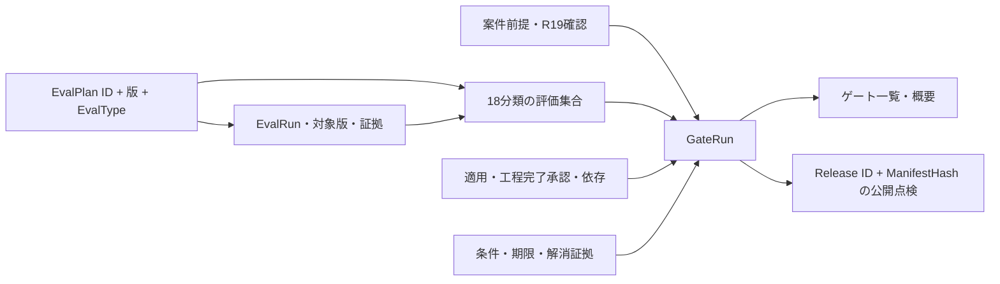

# AI自社事業PJ 工程・判断管理の設計

更新日：2026-09-11。対象：`/ventures`、`/api/v1/ventures`。

事業会社が、仮説検証から投資判断・AI評価・公開・運用・終了までを管理する。工程の入力件数ではなく、証拠・責任者・対象版・前提が接続した判断を表示する。外部の決裁正本や本番実行権限を、このアプリの入力だけで代替しない。

## 正本と責務

工程・評価分類の標準定義は `AIシステム自社事業PJ工程管理_v1_1_敵対的レビュー反映版.xlsx`。132工程、106スキル、20ロール、18評価分類を抽出済みJSONから読み取る。Excelと抽出JSONは変更しない。`venture_governance.extend_master` が、アプリ固有の本人確認・版・日時型・取消の列を補う。Excelの予約行数は参考値として保持し、アプリの件数上限にはしない。

育成・実務証跡の既存設計に対し、本書を事業PJ領域の追加設計正本とする。修正と検証の対応は [修正対応表](venture-review-remediation.md) を参照する。

## 判断データの接続

`gate_run` が判断履歴の唯一の入力元。ゲート一覧と概要は同じ点検結果を射影する。旧 `PATCH /gates/{id}` は400で拒否する。判断を記録したこと、正本を確認したこと、現在も点検が整合していることを分けて表示する。最新行の作成日時で概要を選ぶ。取消や不成立になった最新判断を、過去の承認へ自動的に戻さない。

記録には対象範囲・版、証拠パッケージ、実名とPersonID、独立QA・Privacy・Security、事業Risk受容・予算、判断日、正本URIが必要。正本確認は `verifyRecord: true` の明示操作で行い、確認者・時刻・前提版をサーバが記録する。これらの列をクライアントが直接指定すると403となる。

G3の成立条件：

1. R19が案件のRisk Tier、根拠、RAG/Agent適用と正本URIを確認済み。GateRunの前提版が現在の確認版と一致する。データ用途、外部AI・送信先、Privacy、機能判定、リスク判定、ADR台帳の変更も前提版の更新と再確認を要求する。
2. 同一Release ID・ManifestHash・集合版を対象とするE01〜E18が各1件存在する。全分類の必要／対象外を明示し、集合の版・承認者・承認日・正本URIを持つ。GateRunが指定した集合URIと承認者にも一致する。分類の未登録・重複は画面に表示する。
3. 必須評価は、承認済み計画と完全な合格Runに接続する。PlanKey・ManifestHash・対象Releaseが一致し、取消、記録欠落、未確定判定がない。対象外評価には理由と集合承認が必要。
4. RAG適用ならB4-03とE03/E04、Agent適用ならB4-04とE05を要求する。機能が対象外なら、その工程の除外理由と判定記録が必要。
5. 独立判定、条件の期限・解消・停止判定が整合する。

公開準備は有効なG3の承認／条件付承認を参照し、Release ID・ManifestHashを照合する。差戻し・否決・Stopを公開許可として使わない。評価Run・計画・集合・判断の取消は参照先の再点検によって下流へ反映する。G4の拡大判断は仮説ID、対象範囲／版、対象期間が一致し、必要な行動証拠が揃う仮説を参照する。

## 版と履歴

評価分類 `EvalType`、計画の論理キー `EvalPlan ID@計画版`、台帳行IDを分離する。新しい計画行でもE05を選べばAgentのFixture・Reset・成功率定義が要求される。

承認／対象外承認の計画、合格／不合格のRun、判断済みGateRun、正本確認済みの保護台帳行は内容を上書きできない。訂正は新しい版・Runを作成し、旧行へ取消・置換理由を追記する。取消履歴の消去・変更、確認済み行の再確認による上書きは禁止する。誤って不完全な確定状態を登録した場合も、新しい行で訂正する。確認操作は保存済みの内容に対して行い、未保存変更がある間は画面の確認ボタンを無効にする。

台帳行・案件の物理削除をAPIで拒否し、案件はアーカイブする。台帳・工程・案件前提の変更は変更前後と操作者を監査ログへ保存する。汎用行の進捗状態は事業判断そのものではない。

更新前の権限・確定状態の検査と書込みは同じトランザクションで行う。PostgreSQLは案件行のロック、SQLiteは書込み予約で直列化し、確定操作と内容更新が競合して検査をすり抜けないようにする。

## 工程の完了と依存

`status=完了` は担当者の作業状態。完了数には `completionValid=true` の工程だけを算入する。適用確定、実施者の案件ロール、実開始／実完了日、証拠URI、工程の承認ロールによる承認、日付整合、依存工程の成立が必要。R19が承認する工程は実施者本人が承認できない。除外工程には理由・判定者・判定日時が必要。早期Stopは確認済みで未取消のStop判断を参照する。

証拠・担当・ロール・実績日・依存・適用・状態の重要項目を変更すると、その工程の完了承認を解除する。依存工程の証拠や承認が崩れた場合、下流工程の記録は残し、有効完了から外す。依存変更には理由と操作者・日時を記録し、循環・未知ID・空トークンを拒否する。空の依存リストも理由付きで明示変更できる。

## 案件ロールと確認権限

| 操作 | 必要な権限 |
|---|---|
| 案件作成 | アプリのadmin／recruiter。作成者を案件R02に登録 |
| 案件前提・適用・要員管理 | admin、または案件R01／R02／R18 |
| 台帳記入 | admin、または案件の要員 |
| 工程進捗記入 | 管理権限、またはその工程の担当者 |
| 工程完了承認 | 当該工程の承認ロール。R19は本人実施を禁止 |
| スキル評価 | admin、または案件R02／R19。自己評価は禁止 |
| リスク確認／評価正本確認 | 案件R19 |
| GateRunの正本確認・取消 | マスタで指定されたゲートの最終Aロール |

adminであっても正本確認の業務ロール割当は省略できない。非adminの非メンバーには案件の存在を404で伏せる。個人の能力評価・育成計画は本人と当該案件の評価権限者に限定する。

## 能力割当と稼働

スキル不足は工程×実行ロール×スキルごとに算出する。案件に詳しい人がいるだけでは充足しない。実名割当に本人・ロール・評価記録ID・担当範囲・期間・承認を置く。評価記録IDは同じ本人とスキルの第三者評価・証拠に一致する必要がある。配置期間内のFTEと本人の当日上限を確認し、退任や配置期限切れを充足から外す。複数工程・ロールの不足は最大の不足を概要へ集約し、明細をスキル画面に示す。

指導・外部支援は支援方法、支援者、支援証拠と有効な能力・配置がある場合に扱う。独立評価・品質決裁の不足を、実施者の支援で代替しない。能力評価だけを保存しても、割当と稼働記録がなければ不足は残る。

## 日時、未計測、意思決定の表示

評価実施／承認、公開承認／公開、緊急対応、事故検知／受付／復旧はISO 8601の時差付き日時を受け付ける。例：`2026-09-11T09:30:00+09:00`。比較はUTCへ正規化して同日内の逆転も拒否する。既存の日付だけのイベントを時刻0時へ補完せず、再確認要と表示する。工程の実績日、期限、管理基準日は日単位の項目として扱う。

判定には機械判定コード・severity・表示ラベルを返す。成功表示は完全一致の許可リストのみ。未充足・不一致・未計測・未知の判定を成功色にしない。

費用・売上・工数の必要入力が欠けた場合、合計・利益・単位原価を空欄とし「未計測」を表示する。明示的な0円と欠測を区別し、対象外には理由を残す。概要では仮説、次の実験・再判断日・停止条件、追加投資上限と実績根拠に基づく残額、KPIの分母・閾値・実測、条件期限、資金計画、反復Runの期限を表示する。期限超過を優先して次の行動を並べる。台帳は25件ずつ表示し、点検行がある台帳にも新規行を追加できる。

## DB移行と導入

Alembic revision `20260911_0004` を追加した。`ventures.governance` の既存値は未確認の空オブジェクト。旧 `venture_gates` の判断は `gate_run` へ「移行・正本未確認」として複写し、元の行も残す。確認者・正本URI・対象版を推測して補わない。確定済み旧行の補完は、新しいGateRunの作成と正本確認で行う。

既存DBにはアプリ起動前に `apps/api` で `python -m alembic upgrade head` を実行する。`create_all()` は既存テーブルへ列を追加しないため、起動だけでは移行されない。事前にDBのバックアップを取得し、移行後に旧判断の件数・元の証拠URI・未確認表示を照合する。downgradeは確認列を落とすため運用上の巻戻しにはバックアップと版を揃える。本修正作業では本番DBへの移行・デプロイは実行しない。
